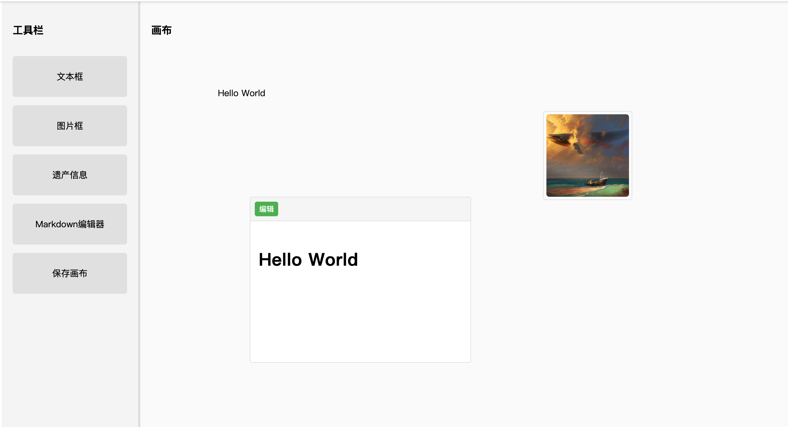
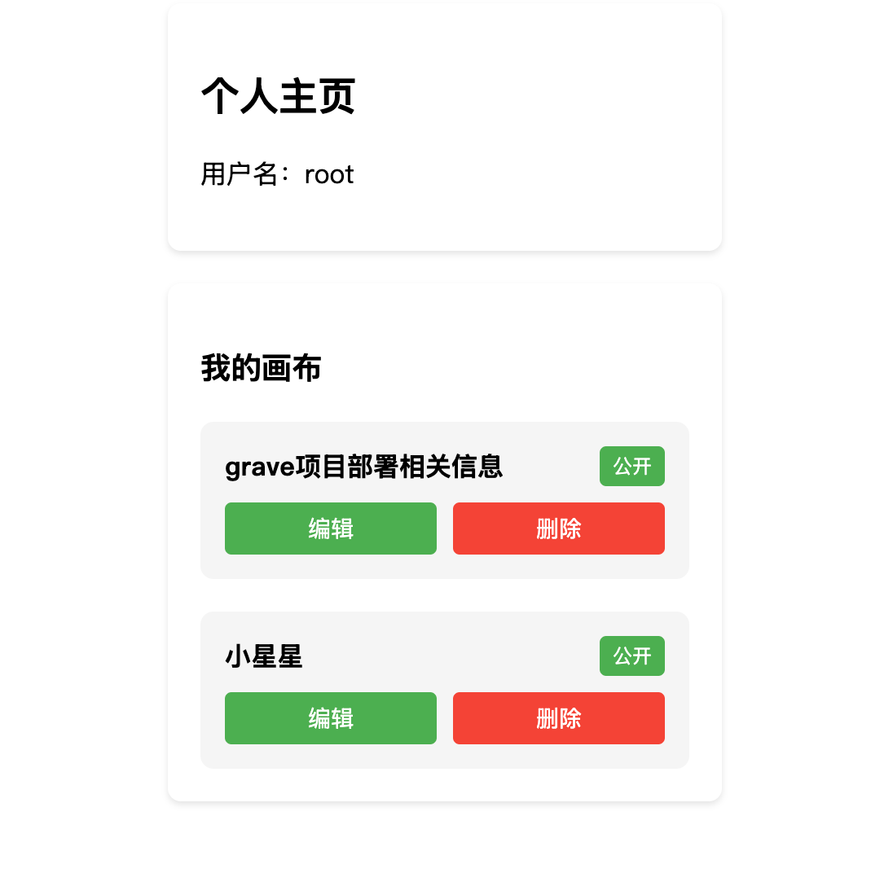
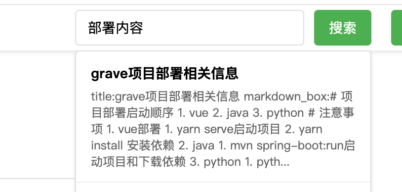
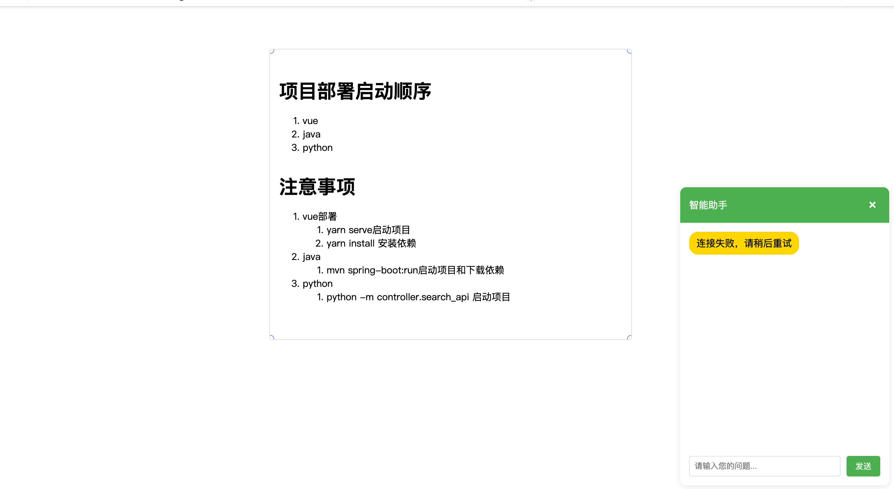

# electronic-grave
everyone can write whole life story in our website

you can access http://101.132.43.211/ to use this project 
## Enviroment Setup(Macbook)
1. basic tool
```
brew install openjdk
brew install maven
brew install mysql 
brew install kafka
brew install vue
brew install yarn  
```

2. programmer enviroment 
    1. python 
    ```
    cd ./code/backend/python
    pip install -r requirements.txt
    ```
    2. java 
    ```
    cd ./code/backend/grave
    mvn spring-boot:run
    ```
    3. mysql
    ```
    注意密码与java的allicaiton.yml文件的对齐
    ```
    4. kafka
    ```
    brew services start zookeeper
    brew services start kafka
    kafka-topics --create --topic heritage-requests --bootstrap-server localhost:9092 --partitions 1 --replication-factor 1
    ```
    5. vue
    ```
    cd ./code/frontend/frontend
    yarn install 
    yarn serve
    ```


## Feature
1. Drag-and-drop canvas editing  


2. Personal homepage to view information(view, edit, and modify personal canvas)


3. Semantic-based search



4. AI-powered conversation based on canvas content


5. To be continued